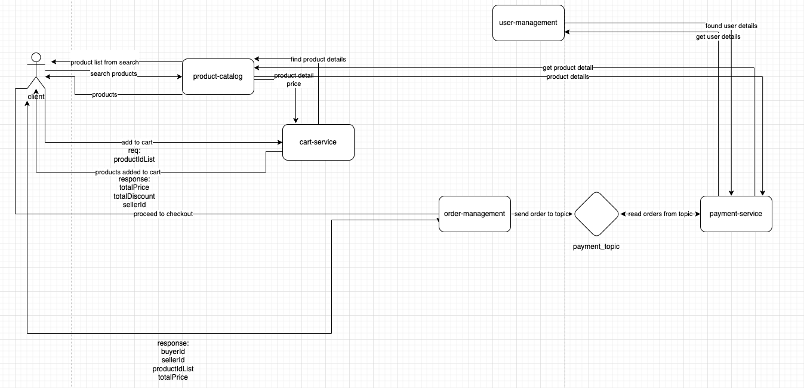
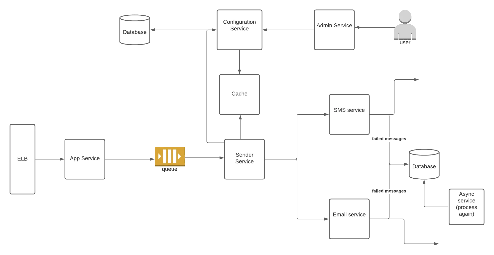

An E-commerce platform typically consists of multiple microservices that work together to provide a seamless shopping experience for customers. Here are some of the key microservices that are commonly found in an E-commerce platform:

1. **Product Catalog Service**:
    - Responsible for managing the productEs information like name, description, price, availability, images, and other relevant details.
    - May handle tasks like productEs search, filtering, and categorization.

2. **User Management Service**:
    - Manages user accounts, authentication, authorization, and user profiles.
    - Handles tasks like user registration, login, password reset, and account information updates.

3. **Shopping Cart Service**:
    - Manages the customer's shopping cart, including adding/removing items, quantity adjustments, and viewing the cart contents.
    - Ensures that the cart state is maintained even if the user logs out or switches devices.

4. **Order Management Service**:
    - Responsible for creating, updating, and managing orders.
    - Handles tasks like order creation, order confirmation, order cancellation, and order history.

5. **Payment Service**:
    - Integrates with payment gateways to handle payment processing.
    - Ensures secure and reliable payment transactions.

6. **Inventory and Stock Management Service**:
    - Keeps track of the available stock of products.
    - Handles tasks like inventory updates, out-of-stock notifications, and restocking alerts.

7. **Recommendation Service**:
    - Provides productEs recommendations based on user behavior, preferences, and historical data.
    - Utilizes algorithms like collaborative filtering, content-based filtering, etc.

8. **Search Service**:
    - Enables users to search for products using keywords, filters, and other criteria.
    - May utilize search indexing techniques for efficient and accurate search results.

9. **Reviews and Ratings Service**:
    - Allows users to leave reviews and ratings for products.
    - Manages and displays these reviews and ratings to aid other shoppers in making decisions.

10. **Notification Service**:
    - Sends out notifications to users for events like order confirmation, shipping updates, promotions, etc.
    - Utilizes various communication channels (email, SMS, push notifications).

11. **Analytics and Reporting Service**:
    - Gathers and analyzes data related to user behavior, sales, productEs popularity, etc.
    - Provides insights that can be used to optimize the platform's performance and user experience.

12. **Content Management Service**:
    - Manages static and dynamic content on the platform, such as productEs descriptions, banners, and landing pages.

13. **Authentication and Authorization Service**:
    - Handles user authentication (login) and authorization (permissions).
    - Ensures secure access to different parts of the platform.

14. **Shipping and Logistics Service**:
    - Manages shipping options, addresses, tracking information, and coordination with logistics partners.

15. **Customer Support Service**:
    - Provides channels for customer support, including features like chat, email, and phone support.

These microservices communicate with each other through APIs, events, or message queues to create a cohesive E-commerce platform. Additionally, they may also interact with external services like payment gateways, shipping providers, and recommendation engines. Each microservice is typically deployed independently, allowing for scalability, fault isolation, and continuous delivery.

- simplified example:
```
  +----------------+         +-----------------------+          +-------------------+
  |    User        |         |    Product Catalog    |          |   Shopping Cart   |
  +----------------+         +-----------------------+          +-------------------+
         |                              |                                 |
         | 1. Browse Products           |                                 |
         |----------------------------->|                                 |
         |                              |                                 |
         |                              |                                 |
         |                              | 2. Get Product Details          |
         |                              |-------------------------------->|
         |                              |                                 |
         |                              |                                 |
         |                              |                                 |
         | 3. Add Item to Cart          |                                 |
         |<---------------------------- |                                 |
         |                              | 4. Update Cart                  |
         |                              |-------------------------------->|
         |                              |                                 |
         |                              |                                 |
         | 5. View Cart                 |                                 |
         |----------------------------->|                                 |
         |                              |                                 |
         |                              |                                 |
         |                              | 6. Get Cart Contents            |
         |                              |<--------------------------------|
         |                              |                                 |
         |                              |                                 |
         | 7. Proceed to Checkout       |                                 |
         |----------------------------->|                                 |
         |                              |                                 |
         |                              |                                 |
         |                              |                                 |
         |                              |                                 |
         |                              |                                 |
         |                              |                                 |
         |                              |                                 |
         |                              |                                 |
         |                              |                                 |
         |                              |                                 |
         |                              |                                 |
         |                              |                                 |
         |                              |                                 |
         |                              | 8. Create Order                 |
         |                              |<------------------------------  |
         |                              |                                 |
         |                              |                                 |
         | 9. Make Payment              |                                 |
         |----------------------------->|                                 |
         |                              | 10. Update Inventory            |
         |                              |------------------------------>  |
         |                              |                                 |
         |                              |                                 |
         |                              | 11. Send Order Confirmation     |
         |                              |----------------------------->   |
         |                              |                                 |
         |                              |                                 |
         | 12. Send Shipping Updates    |                                 |
         |<-----------------------------|                                 |
         |                              |                                 |
         |                              |                                 |
         |                              |                                 |
         |                              |                                 |
         | 13. View Order History       |                                 |
         |----------------------------->|                                 |
         |                              |                                 |
  +----------------+         +-----------------------+          +-------------------+
  |    User        |         |    Order Management   |          |   Payment Service |
  +----------------+         +-----------------------+          +-------------------+

```

1. The user interacts with the platform through actions like browsing products, adding items to the cart, and proceeding to checkout.
2. The Product Catalog service provides productEs details based on user requests.
3. The Shopping Cart service manages the user's cart, allowing for additions, updates, and views.
4. When the user decides to proceed to checkout, an order is created.
5. The Payment Service handles the payment process.
6. After successful payment, the Inventory service is notified to update stock levels.
7. The Order Management service creates the order and sends a confirmation to the user.
8. Shipping updates are sent to the user.
9. The user can view their order history.




#### Notification Service impl:

https://www.google.com/search?q=notification+service&sca_esv=581999558&sxsrf=AM9HkKmAvgB0j2XILIB_vSVRqr_PsRhpFQ:1699906639202&tbm=isch&source=iu&ictx=1&vet=1&fir=bPhO3EN6rEDMHM%252CH8_ewfIW3wjtEM%252C%252Fm%252F0h97k3c%253BwDWEElkR2FDEZM%252CpC1WeCoWjl5XHM%252C_%253BF5ZOC1QSVmRa6M%252Cl8mez312z6e61M%252C_%253Brn3_FngW22jzFM%252CHrO3FAjaDIms9M%252C_%253BvtUHAzwG3E5YnM%252CKb_4PN8rhlqJ8M%252C_&usg=AI4_-kR6hI4BgMXrsTdfx2LuQefkbk9zGg&sa=X&ved=2ahUKEwjT3YXb5cGCAxUzVfEDHQ7HCgQQ_B16BAhGEAE#imgrc=uuqAs0wCP4VI3M
Detailed:
[Detailed](https://www.linkedin.com/pulse/design-notification-system-omar-ismail)



### Cart Service

**Explanation:**

1. The user browses products and adds items to the shopping cart.
2. The user can view the cart, update quantities, or remove items.
3. When the user decides to check out, the shopping cart service interacts with the product catalog service to get the latest details of the products in the cart.
4. The shopping cart service creates an order and initiates the checkout process.
5. The user can view their order history.

This flow diagram is a high-level representation, and in a real-world scenario, you'd have more details, error handling, and potentially asynchronous operations for better scalability. It's also important to consider security aspects, such as authentication and authorization, to ensure that only authorized users can modify their shopping carts and place orders.

### Request and Response Models:

1. **Request to Add Item to Cart:**
``` 
{
  "userId": "123",
  "productId": "ABC123",
  "quantity": 2
}
```

2. **Response from Add Item to Cart:**
``` 
{
  "cartId": "456",
  "totalItems": 3,
  "totalPrice": 50.00,
  "item": {
    "productId": "ABC123",
    "name": "Product Name",
    "price": 25.00,
    "quantity": 2,
    "subtotal": 50.00
  }
}
```

3. **Request to Update Cart Item:**
``` 
{
  "cartId": "456",
  "productId": "ABC123",
  "quantity": 3
}
```

4. **Response from Update Cart Item:**
``` 
{
  "cartId": "456",
  "totalItems": 4,
  "totalPrice": 75.00,
  "item": {
    "productId": "ABC123",
    "name": "Product Name",
    "price": 25.00,
    "quantity": 3,
    "subtotal": 75.00
  }
}
```

5.  **Request to Remove Item from Cart**:
``` 
{
  "cartId": "456",
  "productId": "ABC123"
}
```

6. **Response from Remove Item from Cart:**
``` 
{
  "cartId": "456",
  "totalItems": 3,
  "totalPrice": 50.00,
  "message": "Item removed successfully."
}
```

### User and Cart Relationship:

A user can be related to a cart in several ways, and the appropriate approach depends on the specific requirements of your application. Here are a couple of common scenarios:

1. **User Has One Active Cart:**

    - Each user has a single active cart associated with their account. When a user logs in, the system retrieves their active cart or creates a new one.
    - The relationship can be modeled in a user profile or authentication token.
2. **User Has Multiple Carts:**

    - Users can have multiple carts, each associated with a different session or purpose (e.g., "Wishlist," "Shopping Cart").
    - Carts can be stored with a reference to the user ID.

Here's a simplified representation:

**User Model:**
``` 
{
  "userId": "123",
  "username": "user123",
  "email": "user@example.com",
  "carts": [
    {
      "cartId": "456",
      "status": "active",
      "items": [
        {
          "productId": "ABC123",
          "quantity": 2
        },
        // ... other items
      ]
    },
    // ... other carts
  ]
}
```

In this example, the user model contains an array of carts, each with its own unique ID, status (e.g., "active," "inactive"), and a list of items. The "active" cart is the one currently being used by the user. The user can switch between different carts based on their needs.